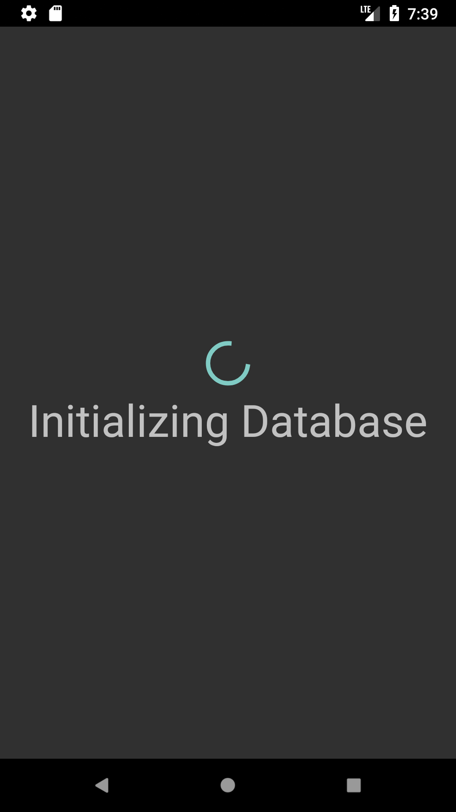
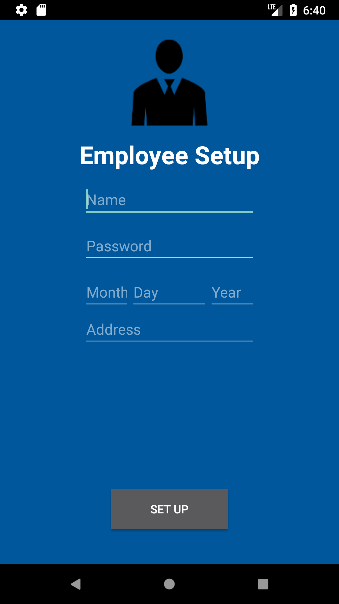
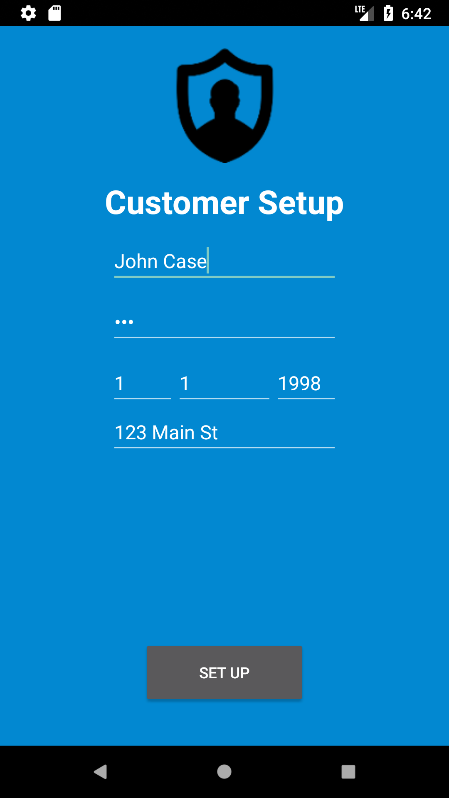
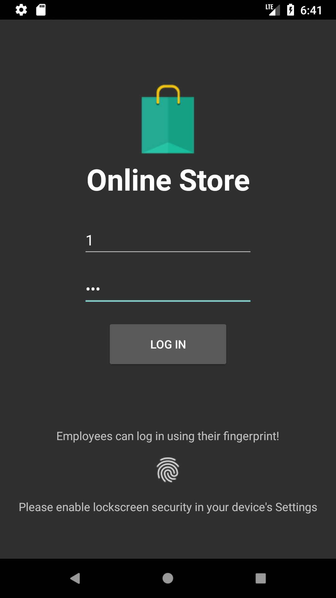
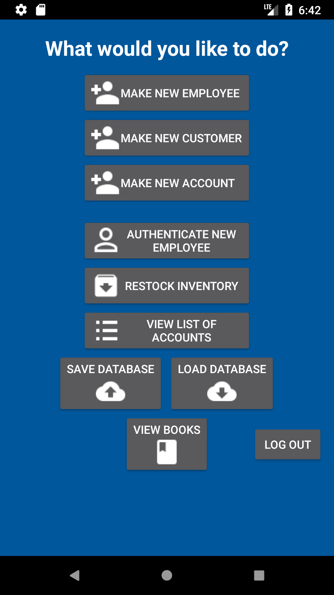
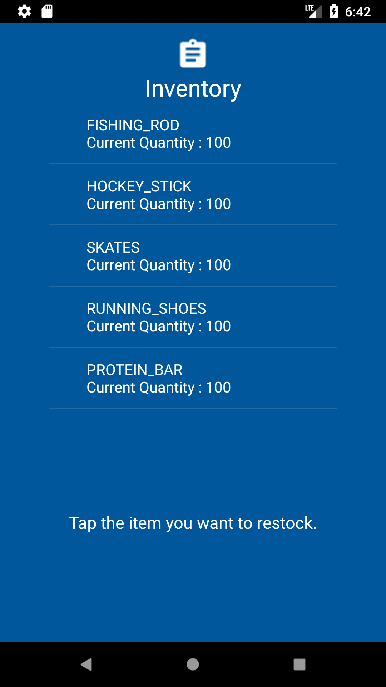
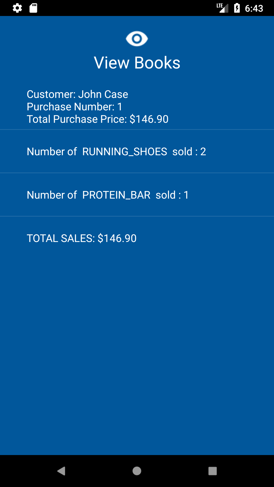
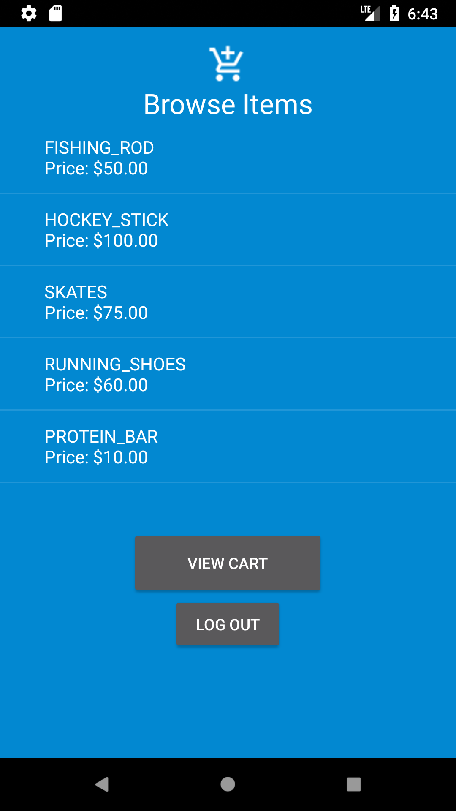
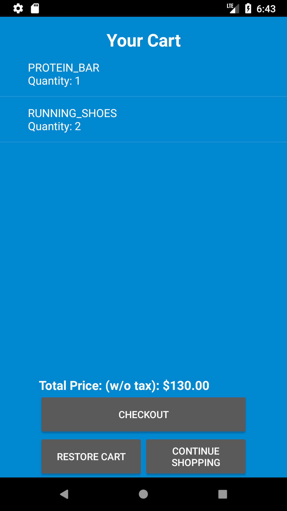

# Online Store
An Android application that mimics an online store, which has both employees and customers, with options to buy, view transactions, restock inventory, and many more.

# Steps to run:
- If you want to download the `.apk`, simply download the `OnlineStore.apk` and transfer it to your Android Device
- If you want to view the source code, download the project, open Android Studio
  - **To run via the emulator, first do Build -> Clean Project, then Build -> Build APK, then click run** 

Here are some cool facts and features:

- All information stored on an internal SQL Database, *which means that data is saved every time you open the application*

   

- Users are **employees** and **customers**, where employees can control the store, and customers buy items from it

   

- On start up, an employee must be created first a first name and last name, password, valid date of birth, and an address. Then it will be given an ***id number***, from which we refer to it

- Then we can login, either using the **id**, or **fingerprint**, by default the first employee created will have id *1*, the second employee/customer will have id *2,3,...etc*. How are customers created? Well here's where the employee comes in

   

- The employee has many options:

  - It can create new employees and customers
  - It can create **accounts for customers**. An account is a way to store a customers **last shopping cart**. For example, if a customer purchases a shoe in sale 1, and has a account, then when the customer goes to make another sale, they have the option to **restore their shopping cart from their account**, which will already add 1 sale to their shopping cart. You can think of an account as an ability to restore your **last** shopping cart
  - An employee can restock the inventory when quantities get low
  - A *special feature* is the ability to **save and load a database**. Remember how I said earlier that the information is stored on a database? This means that you can *transfer store information* from one device to another! Suppose I have bought many items as a customer, then I can *save the database*, and later on *restore it (load it back)* if anything goes wrong. This way you can be sure your store never breaks!
  - An employee can view the books, or see the transactions that have taken place at their store but all the customer. There is also valuable information provided such as total items sold, total sales figures. An employee can view more information by clicking on a sale

   

  - There are many more features of an employee, but here are the main ones. You can discover more by playing around with the app and clicking on what makes sense

- Finally we have the customer:

  - The customer can buy items from the store, and view them in their cart

  - They can choose to checkout, continue shopping, or, if they have an account, they can restore their last purchase

  - If the customer has an account, their purchases are automatically saved and will be visible in the employees view books

    

## Those are just some of the feature of this application. Please download the app and explore the source code to find out more!